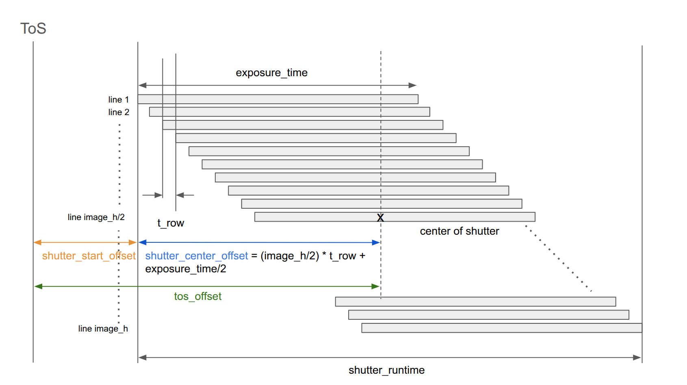

# Co-MLOps Rosbag Metadata Schema

Schema version: 0.1.0

This document defines the schema: field names, types, and semantics. For the role of the metadata, Co-MLOps Platform, and terminology (sensing system, module), see [README.md](README.md).

## Schema version and backward compatibility

Version format is **MAJOR.MINOR.PATCH** (e.g. `"0.1.0"`). A **writer** is a producer of metadata (e.g. the node that publishes the metadata as a ROS topic and records it into a rosbag). A **reader** is a consumer of metadata (e.g. the Co-MLOps Platform when it ingests bags, or any tool that reads the metadata from a rosbag).

Interoperability between reader and writer is **guaranteed only when both use the same MAJOR version**. When MAJOR versions differ, interoperability is not guaranteed.

Within the same MAJOR version, the components behave as follows:

| Component | Role                                                                                                      |
| --------- | --------------------------------------------------------------------------------------------------------- |
| **MAJOR** | Compatibility boundary. Same MAJOR ⇒ backward compatible. Different MAJOR ⇒ may include breaking changes. |
| **MINOR** | Additive only (new optional fields, new sensor types). Readers may ignore unknown fields.                 |
| **PATCH** | Clarifications only. No structural or type changes.                                                       |

## Example

Below is a full example; each property is described in the following sections.

```yaml
schema_version: "0.1.0"
sensing_system_name: "id1_rav4"
sensing_system_id: "6yb9g3aj"
module_id: "qu159UZU"
module_name: "ecu0"
storage_type: "mcap"
sensors:
  lidar:
    - topic: "/sensing/lidar/front/nebula_packets"
      mapped_topic: "/sensing/lidar/front/lidar_packets"
      frame_id: "lidar_front"
      type: "nebula_msgs/msg/NebulaPackets"
      hz: 10.0
      tos_offset: 0.0
      name: "LiDAR Front"
    - topic: "/sensing/lidar/right/nebula_packets"
      mapped_topic: "/sensing/lidar/right/lidar_packets"
      frame_id: "lidar_right"
      type: "nebula_msgs/msg/NebulaPackets"
      hz: 10.0
      tos_offset: 0.0
      name: "LiDAR Right"
  camera:
    - topic: "/sensing/camera/camera0/image_raw/compressed"
      mapped_topic: "/sensing/camera/front_narrow/image_raw/compressed"
      frame_id: "camera0/camera_link"
      type: "sensor_msgs/msg/CompressedImage"
      hz: 20.0
      tos_offset: 50.0
      name: "Camera Front Narrow"
      image_w: 3840
      image_h: 2160
    - topic: "/sensing/camera/camera1/image_raw/compressed"
      mapped_topic: "/sensing/camera/front_wide/image_raw/compressed"
      frame_id: "camera1/camera_link"
      type: "sensor_msgs/msg/CompressedImage"
      hz: 20.0
      tos_offset: 50.0
      name: "Camera Front Wide"
      image_w: 3840
      image_h: 2160
    - topic: "/sensing/camera/camera2/image_raw/compressed"
      mapped_topic: "/sensing/camera/front_right/image_raw/compressed"
      frame_id: "camera2/camera_link"
      type: "sensor_msgs/msg/CompressedImage"
      hz: 20.0
      tos_offset: 50.0
      name: "Camera Front Right"
      image_w: 2880
      image_h: 1860
    - topic: "/sensing/camera/camera3/image_raw/compressed"
      mapped_topic: "/sensing/camera/back_right/image_raw/compressed"
      frame_id: "camera3/camera_link"
      type: "sensor_msgs/msg/CompressedImage"
      hz: 20.0
      tos_offset: 50.0
      name: "Camera Back Right"
      image_w: 2880
      image_h: 1860
```

## Top-level fields

**Presence** in the tables below has the following meaning:

- **required**: The field MUST be present and MUST NOT be `null`. Writers must supply a value; readers may assume the field exists and is non-null.
- **optional**: The field MAY be omitted or MAY be set to `null`. Writers may leave it absent or set it to `null`; readers must handle both cases.

| Field                 | Presence | Type   | Description                                                                                                           |
| --------------------- | -------- | ------ | --------------------------------------------------------------------------------------------------------------------- |
| `schema_version`      | required | string | Schema version (see above). Format: `MAJOR.MINOR.PATCH`.                                                              |
| `sensing_system_name` | optional | string | Human-readable label for the sensing system (e.g. vehicle name). Not required to be unique.                           |
| `sensing_system_id`   | required | string | Unique identifier of the sensing system. Must be unique within the Co-MLOps Platform (may be issued by the Platform). |
| `module_id`           | required | string | Unique identifier of this module (ECU). Must be unique within the same sensing system.                                |
| `module_name`         | optional | string | Human-readable module label (e.g. `"ecu0"`).                                                                          |
| `storage_type`        | required | string | Bag storage format. Supported: `"mcap"`, `"sqlite3"`.                                                                 |
| `sensors`             | required | object | Sensor lists keyed by type (`lidar`, `camera`, etc.). See below.                                                      |

## sensors structure

`sensors` is an object whose keys are sensor categories (e.g. `lidar`, `camera`). Each value is a list of sensor/topic entries. Every entry has the common fields described under **sensors.\*** below; some sensor types add type-specific properties (see per-type sections).

## sensors.\* (common fields)

Every sensor entry has these fields.

| Field      | Presence | Type   | Description                                                                |
| ---------- | -------- | ------ | -------------------------------------------------------------------------- |
| `topic`    | required | string | ROS topic name as recorded on the ECU.                                     |
| `frame_id` | required | string | TF frame ID for this sensor.                                               |
| `type`     | required | string | ROS message type (e.g. `"nebula_msgs/msg/NebulaPackets"`).                 |
| `hz`       | required | float  | Expected message publish rate (Hz) for this topic when operating normally. |
| `name`     | optional | string | Human-readable sensor label.                                               |

## sensors.lidar

Each entry in `sensors.lidar` uses the common fields in **sensors.\*** and has the following properties:

| Field          | Presence | Type   | Description                                                                                                                                                                                                                                  |
| -------------- | -------- | ------ | -------------------------------------------------------------------------------------------------------------------------------------------------------------------------------------------------------------------------------------------- |
| `mapped_topic` | required | string | Reserved topic name on the Co-MLOps Platform; used to map `topic` for visualization layout and for Co-MLOps Dataset (nuScenes fork) conversion. Allowed values and semantics for lidar are described in the Co-MLOps Platform documentation. |
| `tos_offset`   | required | float  | Offset (ms) from ToS to the temporal center. Sign: positive = after ToS, negative = before ToS. Details for lidar: Co-MLOps Platform documentation.                                                                                          |

## sensors.camera

Entries under `sensors.camera` add the following type-specific properties in addition to the common fields in **sensors.\***:

| Field          | Presence | Type    | Description                                                                                                                                                                                                                                   |
| -------------- | -------- | ------- | --------------------------------------------------------------------------------------------------------------------------------------------------------------------------------------------------------------------------------------------- |
| `mapped_topic` | required | string  | Reserved topic name on the Co-MLOps Platform; used to map `topic` for visualization layout and for Co-MLOps Dataset (nuScenes fork) conversion. Allowed values and semantics for camera are described in the Co-MLOps Platform documentation. |
| `image_w`      | required | integer | Image width (pixels).                                                                                                                                                                                                                         |
| `image_h`      | required | integer | Image height (pixels).                                                                                                                                                                                                                        |
| `tos_offset`   | required | float   | Offset (ms) from ToS to the temporal center of the camera exposure. Sign: positive = after ToS, negative = before ToS. See below for definition and figure.                                                                                   |

### tos_offset (camera)

`tos_offset` is the offset time in milliseconds from **top of second (ToS)** to the **temporal center** of the image capture.

- **Sign convention**: Positive = center is after (later than) ToS. Negative = center is before (earlier than) ToS.
- For rolling shutter and global shutter, see [Rolling shutter](https://en.wikipedia.org/wiki/Rolling_shutter) and [Global shutter](https://en.wikipedia.org/wiki/Global_shutter) on Wikipedia.

The figure below illustrates this definition.


The following figure is supplementary material for **calculating** `tos_offset`. This model applies to both rolling shutter and global shutter.



Variables in the figure:

- **exposure_time**: Duration each line is exposed (or, for global shutter, the simultaneous exposure duration). Assumed to be fixed (constant).
- **t_row**: Time between the start of exposure for consecutive lines. Rolling shutter: > 0; global shutter: = 0.
- **shutter_start_offset**: Time from ToS to the start of the first line's exposure. Sign: positive when the start is after (later than) ToS; negative when it is before (earlier than) ToS.
- **shutter_center_offset**: Time from the start of the first line's exposure to the temporal center of the middle line's exposure. Always positive. For rolling shutter: `(image_h/2) × t_row + exposure_time/2`.

**Formula:** `tos_offset = shutter_start_offset + shutter_center_offset`
